大家好，我是 Sunday。

现在 AI 实在是太火了，看今年各大厂的招聘信息 AI 的岗位占比极高。以 **阿里** 为例，26 届的秋招 AI 相关的岗位占比就超过 60%。阿里云、阿里国际、钉钉的 AI 岗位占比更是达到了 `80%`

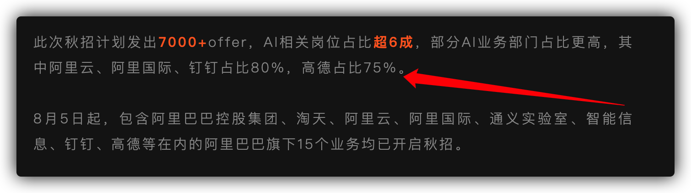

那很多同学就说了：“Sunday 老师，那现在纯前端还能活下去吗？”

先说答案：**能！**

**但是！** 如果你想要活的更好，那么纯前端是不行的，你需要接触 `AI 开发` 相关的东西。那么接触 AI 是不是就要转型到 AI 大模型呢？ **不是的** 这是两个概念。

很多前端同学一听到“AI 开发”，脑子里立马浮现出 Python、PyTorch、线性代数、微积分……然后直接被劝退。

大家一定要纠正一个误区：**AI 应用开发 ≠ 训练大模型。**

对于 99% 的企业和开发者来说，我们不需要去从零训练一个类似 GPT-4 或 DeepSeek 的模型。那是算法工程师和科学家做的事。**我们做的是AI 应用落地。**

对于前端工程师来说，**基于 Node.js 的全栈 AI 能力，就是你切入 AI 赛道最快、且护城河最深的路径！**

为什么？

1. ✅ 语言无缝衔接：LangChain.js、Vercel AI SDK 等主流 AI 框架对 JavaScript 的支持已经到了“一等公民”的级别。
2. ✅ 无需切换思维：你不需要去学 Java 的臃肿，也不用去补 Python 的语法。用你最熟悉的 TS/JS，就能直接操控 LLM。
3. ✅ 统治全栈：前端（交互）+ Node.js（逻辑）+ LLM（大脑）。这三者结合，意味着你一个人就是一个团队。

**你依然是一个前端工程师**，但你是一个掌握了 Node.js 全栈与 AI 落地能力的“超级前端”。 这种 “一人抵这一个组” 的稀缺性，才是当下市场最看重的。

所以，我们花了半年多的时间，开发了两款商业级别的应用 `简历汪` 与 `面试汪`。并且在 **面试汪** 中提供了三种 AI 模型：**面试押题、专项面试模拟、行测+HR面试**

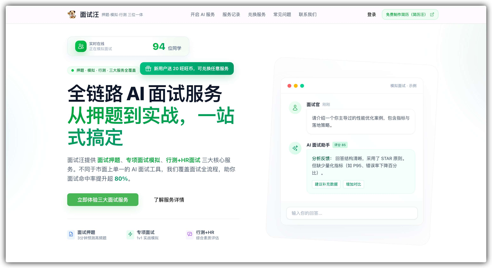

应用上线 3 个月，就已经有了 4 万多的用户，日活 UV 过千了。

而在今天，我们把这样的一个真实的商业级应用，打包成了 **两套课程**：

- 基于 NestJS 的面试汪后端 **（本次主角）**
- 基于 NuxtJS 的面试汪前端

今天咱们主要介绍的就是 **第一套课程：【基于 NestJS 的面试汪后端】**，我们把它叫做 `【AI 智能面试平台】` **一个 基于 NestJS + LLM 的企业级 AI 面试 SaaS 平台。**

**为什么要教 NestJS？** 因为它是 Node.js 领域的 “Spring Boot”，是企业级开发的标准。它能让你用写前端的语言（TypeScript），写出媲美 Java 架构的后端系统。将来无论是你要转全栈，还是 前端 + AI，这都是所有前端同学的最佳选择！

**项目背景是解决 4 万+ 真实用户的面试痛点，绝非单纯的 CRUD 玩具项目。** 它的目的是利用 AI 技术，通过“**面试押题、专项模拟、HR 软技能对练**”三大核心场景，帮助求职者精准预测考题、模拟真实面试流程，从而大幅提升面试成功率。

这套《AI 智能面试平台》项目实战文档目前已更新 **29 万字**（预计完结 45 万字），涵盖了 **NestJS 核心架构、RAG 知识库构建、Prompt 工程设计、SSE 流式交互** 等等。足够满足现在的 **前端同学想要学习 AI 应用开发，接触 AI Agent、RAG 内容的需求，从而掌握突击中大厂的能力！**

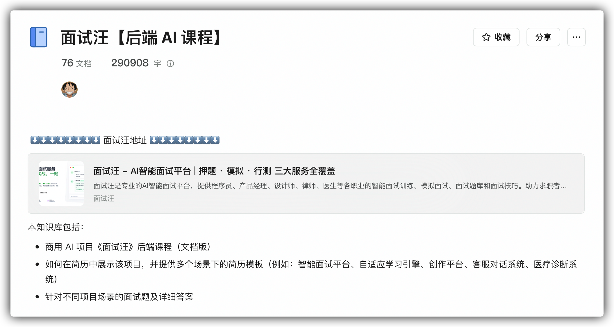

> 这套课程就是为了证明：**前端同学不需要转行，只需要利用 Node.js 补齐后端短板，就能瞬间掌握突击中大厂的 AI 应用开发能力！**

不仅如此，我做训练营这么多年，还能不知道大家真正的痛点是什么吗？很多同学都说：“学了课程又咋样，简历不会写！面试也不知道怎么说！光学了...”

**不会！**，为了解决大家这个问题，我直接给大家提供 **`学习 -> 写简历 -> 面试题 -> 模拟面试`** 的全套服务，一条龙到家！！！

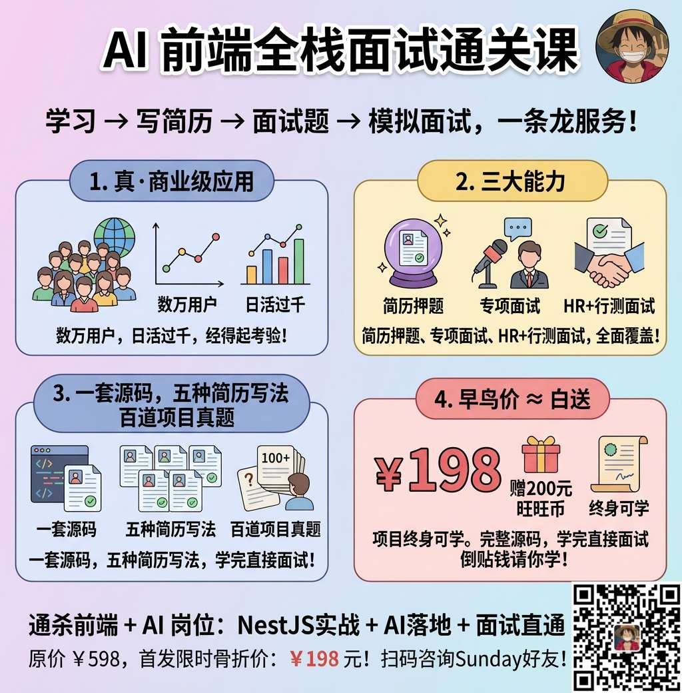

### 1. 一套源码，五种简历写法

我们按照大厂标准，帮大家总结了技术难点和亮点。

整个课程大家可以根据自己的实际工作的业务不同、侧重点的不同，可以包装成 `5` 个不同的项目经验（AI 智能面试平台、智能自适应学习引擎、AI 智能创意写作工具、AI 客服智能对话系统、AI 医疗诊断辅助系统），**后续还会增加出更多的项目经验**，争取可以适配不同业务方向同学的简历

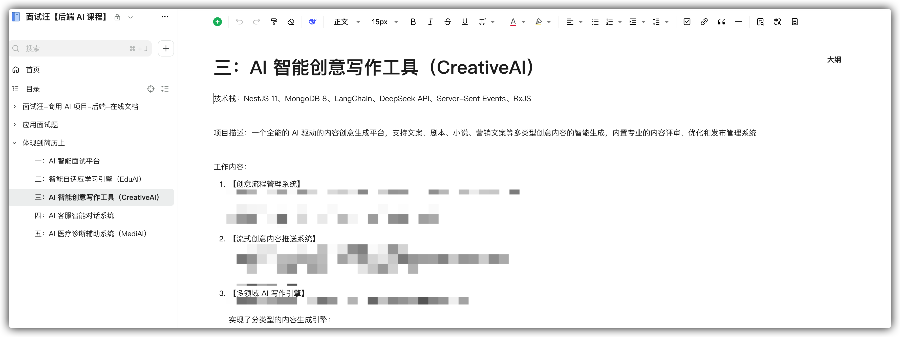

学完这个课程，简历就可以直接做出来了！

### 2. 百道面试真题

学完了，简历有了，面试不会说咋办？

**没事！**

我们专门根据大家的本项目的核心重点和简历上的内容，整理出了不同的项目对应的不同的面试问题：

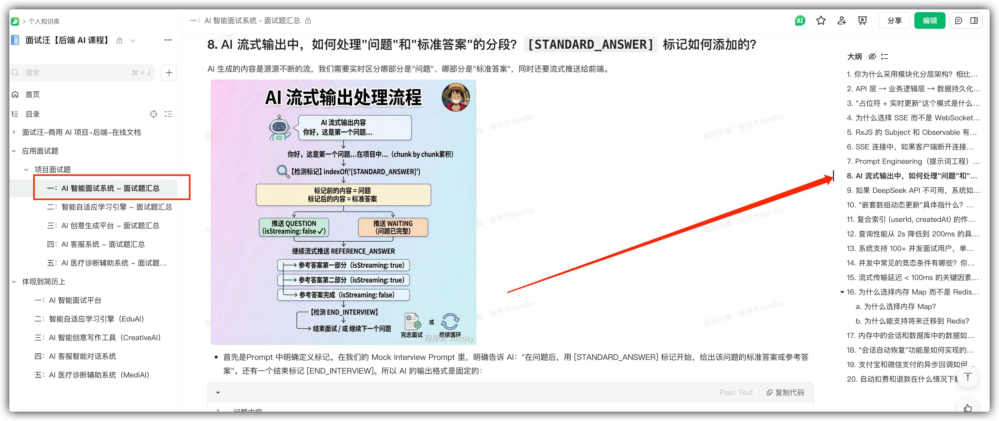

每个项目大约 20 多个题目，5 个项目合计 `100 多个题目`。足够大家在面试中根据面试官的 “深挖” 进行回答了！

### 3. 早鸟价 ≈≈ 白送

课程原价 ~~**598 元**~~ ，首发价 **`198`** 。但大家如果现在购买，我们 **直接赠送价值 `200 元` 的面试汪“旺旺币”（可用于 10 次 AI 模拟面试）**。

**198 - 200 < 0，这不仅仅是打折，这相当于我们在倒贴钱请你学习！**

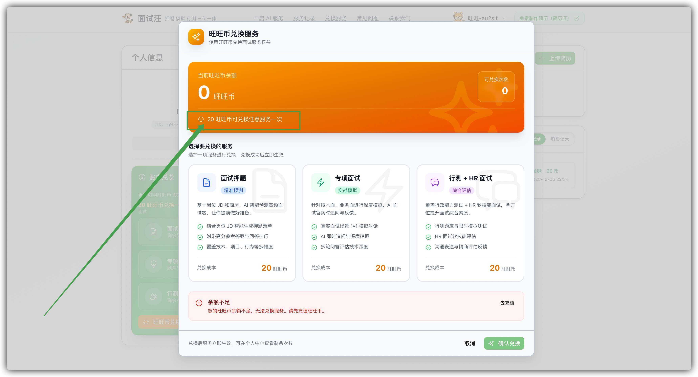

**总结一下：学完这个项目，你将通杀市面上的 前端 + AI 应用开发岗位！**

*   **NestJS 深度实战**：不仅会用，更懂原理。彻底吃透这个 Node.js 界的“工业级标准”，让前端也能 Hold 住复杂后端架构。
*   **AI 核心技术落地**：不再对着 RAG、Agent、Prompt 等名词发呆，而是知道它们在代码里是怎么跑起来的。
*   **面试直通车**：最重要的一点，我们教你技术，更教你 **如何把这个技术讲给面试官听**。

---

**项目原价 ~~**598 元**~~ ，首发限时骨折价：`198 元`！**

> 再加上，**购买即送价值 200 元的旺旺币（可兑换 10 次 AI 面试）**。这意味着你不仅学了技术，还免费获得了一个私人 AI 面试教练。

**具体购买方式**，微信扫码下方二维码，添加 `Sunday` 微信购买咨询：

---

接下来 Sunday 给大家快速拆解这个项目，希望让更多需要它的同学看到，把它变成自己的项目，让自己的简历竞争力 Up Up！

## 项目系统架构长啥样？

这可不是那种只有两个接口的 Demo。为了支撑 4 万+ 用户的稳定运行，我们设计了企业级的系统架构。

**后端核心架构图：**

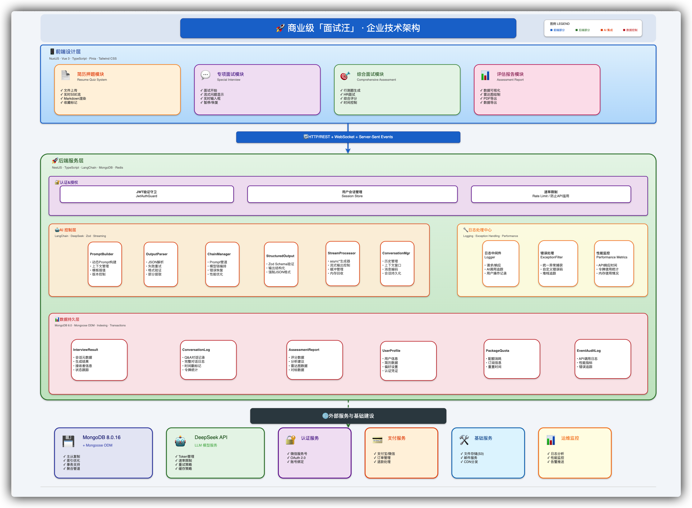

我们基于 **NestJS** 构建了高内聚、低耦合的模块化架构。涵盖了 **鉴权模块、支付模块、AI 核心模块、用户模块** 等。同时结合 **MongoDB** 进行灵活的数据存储，保证了系统的高性能与可扩展性。

## 项目核心业务流程与技术亮点

为什么说这个项目能写进简历？因为它不是一个简单的 API 套壳，而是一个经历了 4 万+ 用户高并发验证、具备复杂状态管理和高性能要求的商业级系统。

看看这些核心流程背后的技术深度，你就明白了：

### 1. 极致 SSE 体验：

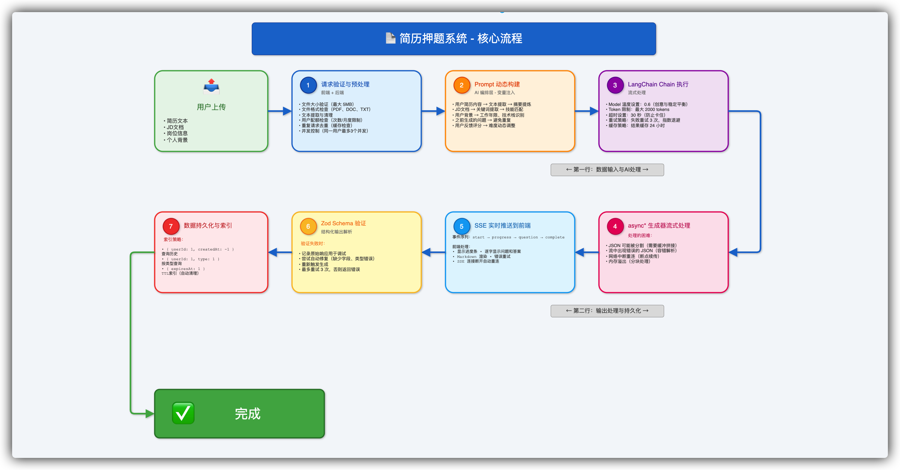

普通项目可能只是调个 GPT 接口，但我们构建了一套基于 LangChain + RxJS 的高可编排 AI 工作流：

**多阶段 Prompt 编排**：我们不是“一问一答”，而是设计了“简历解析 -> 岗位匹配 -> 考点提取 -> 题目生成”的 Pipeline。通过 Prompt 工程的 V1 -> V3 迭代，从通用模板升级为个性化精准匹配，让 AI 真正读懂候选人。

**极致的流式交互**：为了达到类似 ChatGPT 的体验，我们基于 SSE (Server-Sent Events) 实现了 <100ms 的首字响应。通过禁用 Nginx 缓冲、后端立即 Flush 等底层优化，解决了传统 HTTP 请求的等待焦虑。

**技术关键词**：LangChain、RxJS、SSE 流式输出、Prompt Engineering、向量检索

### 2. 智能 Agent 决策与会话状态管理：

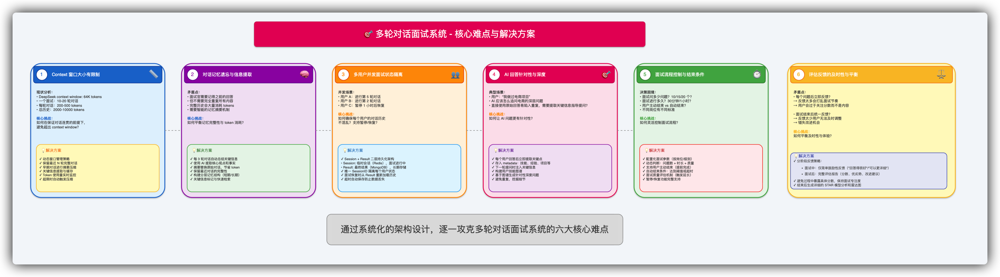

模拟面试不是简单的聊天，而是一个复杂的长链接状态机。AI 需要像真人面试官一样，根据你的回答动态决定下一步操作：

**动态决策逻辑**：利用精密的 Prompt Chain（提示词链） 和 上下文窗口管理，AI 会实时分析候选人的回答质量，动态判断是“继续深挖追问”、“通过进入下一题”还是“结束面试”。

**异常灾难恢复**：如果用户浏览器崩溃了怎么办？我们构建了 Session 级会话恢复机制。通过将 sessionState 实时持久化到数据库，支持用户重新打开浏览器后，无缝恢复到刚才面试打断的那一句话，体验极其丝滑。

**技术关键词**：Agent 决策、上下文管理、Session 持久化、断点续传、状态机设计

### 3. 金融级数据一致性与高并发架构：

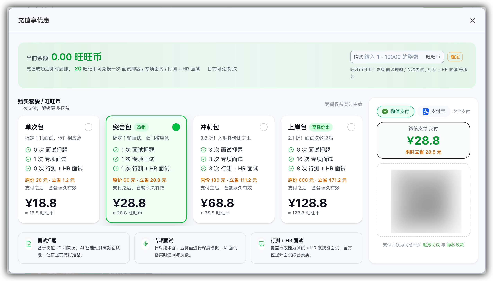

除了 AI 能力，作为一款 SaaS 商业产品，系统的稳定性和数据的准确性是底线。这部分内容能证明你具备中大厂要求的严谨后端开发能力：

**支付与权益保障**：如何防止用户付了钱没到账？或者并发扣费导致余额为负？我们采用了 MongoDB 原子操作 + 状态机设计，配合支付宝/微信的异步回调幂等性处理，确保在任何高并发场景下，用户的“旺旺币”和权益绝不丢失，实现数据的最终一致性。

**10 倍性能优化**：面对 4 万+ 用户的查询压力，我们没有堆机器，而是从数据库层面入手。通过复合索引设计、字段投影（Projection）、以及查询语句优化，将核心接口的响应时间从 2 秒压缩到了 200ms，实现了 10 倍 的性能飞跃。

**技术关键词**：MongoDB 原子操作、分布式锁、支付幂等性、数据库性能调优、NestJS 模块化架构

### 4. 完全区别于 “玩具 Demo”

这个项目完全区别于市面上的“玩具 Demo”，它具备以下核心竞争力：

- **真实商业验证**：已上线 3 个月，4 万+ 用户，日活过千。这代表你写的代码是经受过市场检验的，而非“自嗨”产物。
- **全栈技术闭环**：从前端 SSE 流式交互，到后端 NestJS 架构，再到 AI Agent 编排 和 数据库调优。你掌握的是一条完整的、高价值的技术链路。
- **看得见的 AI 能力**：你可以直接在面试中拿出电脑，让面试官在线体验这个产品。当他看到 AI 实时生成出精准的面试题时，这种震撼力胜过千言万语。

学完这个项目，你简历上的“项目经验”一栏，将成为面试官最感兴趣的加分项！

## 项目有什么亮点？

从 AI 智能面试平台项目中你可以学到：

- ✅ 如何基于 LangChain 和 RxJS 设计 AI 工作流，通过多阶段 Prompt 编排实现简历押题、专项面试、综合评估的三层 AI 处理流程？
- ✅ 如何通过 Prompt 工程迭代（V1 基础 → V2 精准 → V3 深度），从通用模板升级到个性化高质量的面试题生成，实现精准匹配候选人背景？
- ✅ 如何基于 SSE 实现 <100ms 的流式输出，通过禁用 Nginx 缓冲、立即 flush 等优化，打造类似 ChatGPT 的实时逐字显示体验？
- ✅ 如何通过 MongoDB 原子操作 + 状态机设计，确保并发场景下的交易一致性，防止重复扣费、权益丢失等问题？
- ✅ 如何构建会话恢复机制：通过 sessionState 实时持久化到数据库，支持用户浏览器崩溃后无缝恢复面试进度，实现高可靠的长流程交互？
- ✅ 如何设计支付异步回调系统：通过原子状态转换、幂等重试、最终一致性保证，实现支付宝/微信支付的可靠接入？
- ✅ 如何从多个维度优化数据库查询：通过复合索引、字段投影、ORM 优化、分页查询，实现从 2 秒到 200ms 的 10 倍性能提升？
- ✅ 如何从业务价值、技术深度、工程可靠性多维复盘项目，体现 AI 应用如何解决求职市场的真实痛点？

这个项目不是一个简单的 Demo 项目，而是：**真·商业级应用！**

## 项目文档与学习服务

我们深知，对于想转型的同学来说，代码只是骨架，文档和思路才是灵魂。 为了确保大家能学会、能落地，我们构建了“保姆级”的学习保障体系。

### 1. 保姆级语雀文档（更新中）：

我们不屑于做那种只有几页说明书的“烂尾”项目。学习主要以 **语雀知识库文档** 的形式进行。

全套文档预计 **45 万字**，目前我们已经爆肝更新了 **29 万字**！

从环境搭建、NestJS 基础语法，到 AI 模块开发、RAG 架构设计、再到 Docker 部署上线。每一个步骤都有详细的图文解析，细致到连报错怎么解决都写进去了。

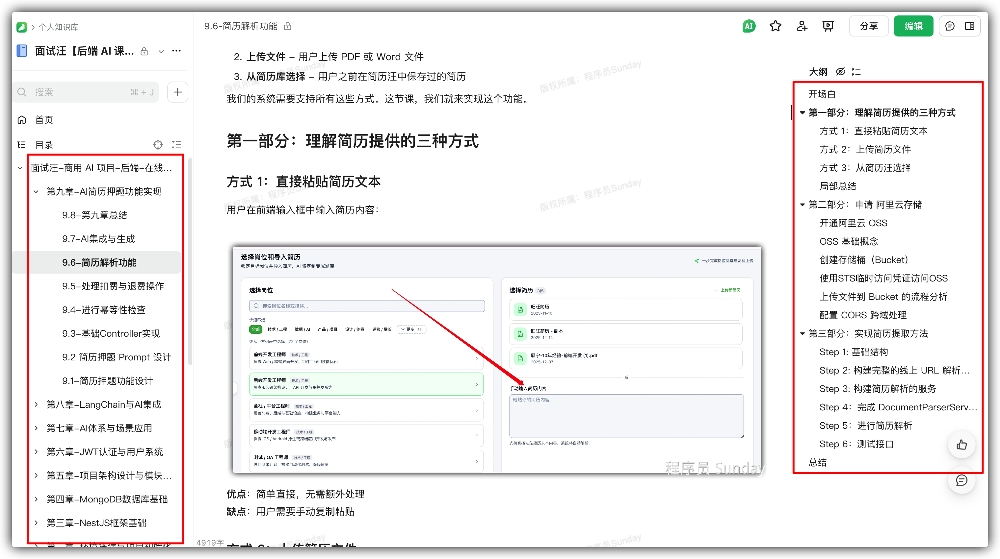

> **单个小节长度通常在 6000 ～ 10000 字之间**。这不仅是课程文档，更是你未来工作中随时可以查阅的 Node.js + AI 开发字典。

### 2. 学习门槛与周期：

很多同学担心：“我没写过后端，能学会吗？”

* **门槛极低**：你只需要具备 **JS、TS 的基础** 即可。关于 NestJS 和 MongoDB 的所有后端知识，课程里都会从零开始，手把手带你入门到精通。只要你会写 console.log，你就能学会这个项目！
* **成型极快**：大约 **4 ～ 6 周**。每天花点时间，一个月后，你就不再是一个单纯的前端，而是一个拥有完整 AI 商业项目经验的全栈开发者。

### 3. VIP 专属社群答疑：

学习最怕什么？最怕遇到 Bug 没人问，卡几天想放弃。

购买课程后，你将加入 **VIP 专属交流群**。
* 有问必答：Sunday 老师和助教团队会在群里直接解答你的技术疑惑。
* 人脉圈子：群里都是来自各大厂、即使在大环境不好依然坚持学习的优秀同学，加入这里，就是加入了一个高质量的技术人脉圈。

### 4. 拒绝焦虑，终身可学

很多同学问：“最近加班多，怕没时间学，有时间限制吗？”

**完全没有！**

我们拒绝制造时间焦虑。报名后，**项目源码、课程文档、视频更新** 均为 **终身有效**！哪怕你现在囤着，等到下半年跳槽前再突击，也完全没问题。

一次付费，终身拥有一套不断迭代的 AI 知识库。

## 项目适合哪些同学？

### ✅ 如果你是以下几类人，这个项目就是为你量身定做：

- **急需亮点的校招/应届生**：简历平平无奇？本项目能让你手握“商业级 AI 落地经验”，在满是 CRUD 的竞品简历中实现降维打击，直通大厂面试。

- **遭遇瓶颈的前端老兵**：厌倦了单纯的切图和写页面，担心 35 岁危机？这里是你**低成本转型“AI 工程师”**的最佳跳板，用技术厚度构筑职业护城河。

- **想转 AI 但不想学 Python 的开发者**：对 Python 庞大的体系望而却步？带你用最熟悉的 JS/TS 栈，直接撬动大模型能力，走通 AI 全栈开发的捷径。

- **进阶全栈的 Node.js 学习者**：不满足于写简单的 Express 脚本？带你掌握 NestJS 企业级架构（AOP、微服务、设计模式），真正打通前后端任督二脉。

### ❌ 以下同学请慎重考虑：

**“伸手党”或 纯视频学习依赖者**：本项目以 45万字保姆级文档 为主。我们坚持认为，阅读高质量技术文档是迈向高级工程师的必经之路。如果你无法静下心来阅读文档，不仅学不好这个课，也难以适应大厂的工作模式。

## 如何报名？

最后，咱们再来算笔账。

项目原价 ~~**598 元**~~ 

**首发早鸟价：198 元**。

**重点来了**：现在购买，`直接赠送 「面试汪 200 旺旺币」（价值 「200 元」）`。
这些币你可以用来兑换 **10 次** 完整的 AI 面试押题、专项面试或 HR 模拟。

**支付 198 元 === 获得 200 元的服务 + 一套商业级 AI 项目课程 + 5 套简历模板 + 100 多道面试题。**

**这相当于我们不仅没收钱，还倒贴了你 2 元！**

如果你正准备面试，或者想转行 AI 开发，这绝对是目前市面上**性价比最高、最硬核**的选择。

**早买早学，早拿 Offer！价格后续一定会涨，现在就是底价。**

支付购买后，你会获得进入语雀知识库的权限，开启你的 AI 进阶之旅！
